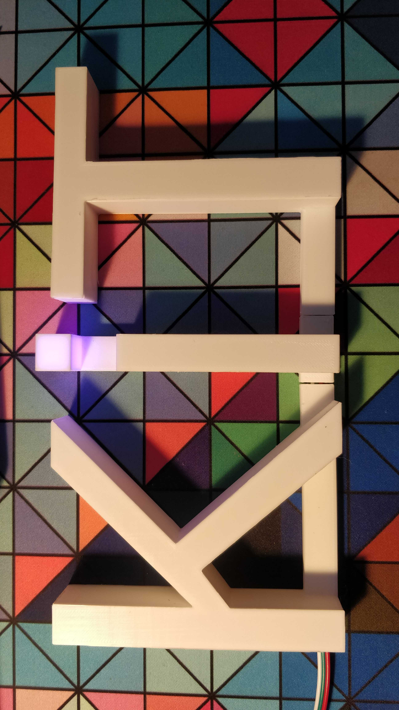
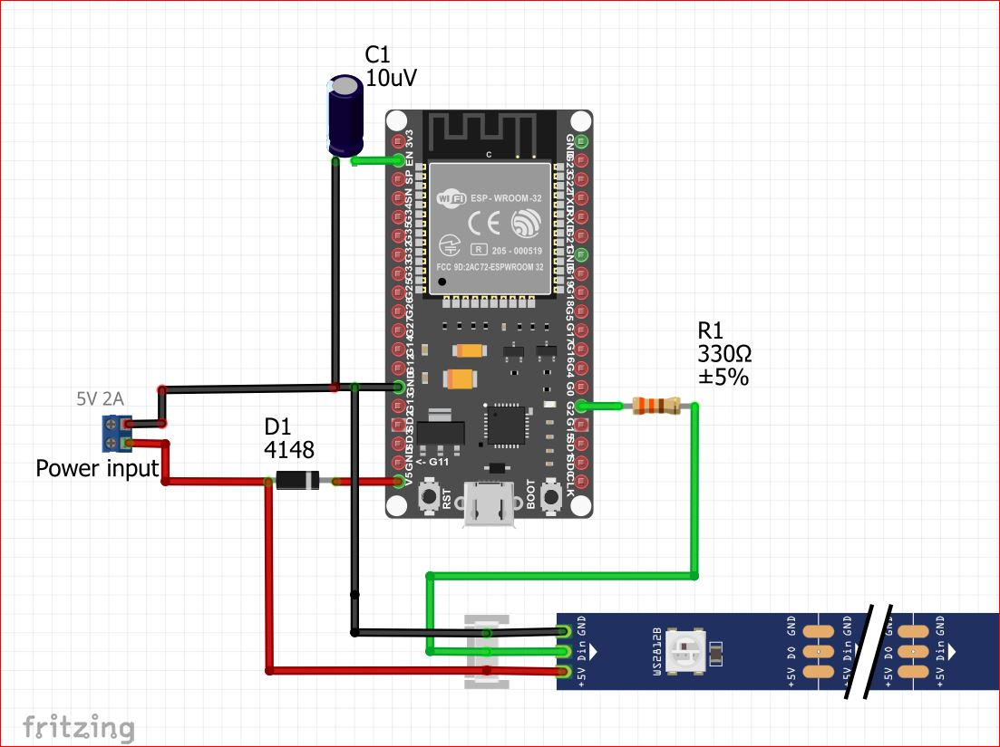
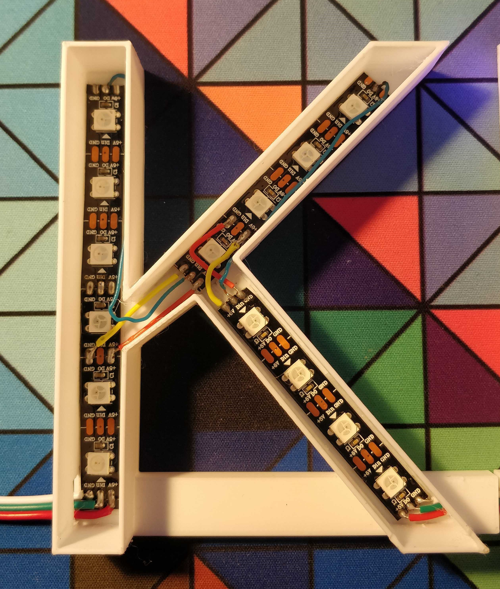

\> Work In Progress <

Still documenting the repo

# Kitboga Twitch Status

Notification sign for Kitboga stream status on Twitch.

## Description

Update 06-12-2025:

- now with proper mTLS - script now uses a cert to authenticate via https. Use https://projects.petrucci.ch/esp32/?page=ssl.php&url=https%3A%2F%2Fapi.twitch.tv to obtain the new cert when needed.

Project uses an ESP32 DEVKIT V1 to call the TwitchTV Helix API to check status of Kitboga's stream. The result is displayed on a 3D-printed sign with addressible RGBs and FastLED library.

NOTE: The STLs are a small remix of a great design by makkuro [thing:749887](https://www.thingiverse.com/thing:749887).

# Details

When my fav streamer Kitboga (https://www.twitch.tv/kitboga) comes up live I get notified with all the LEDs lighting up in the stream's colour.

When he's offline, only 1 LED over _i_ illuminates.

Also some basic error states are displayed with various colours.

### Indication Codes

- blinking 1 blue == connecting to WiFi
- blinking 1 green == setting up the clock the via pool.ntp.org
- solid 1 blue == WiFi Disconnected
- solid 1 green == setup complete (WiFi/Clock OK)
- solid 1 teal == Unauthorized/Expired token - no action needed if validate works, auto re-new of the token will happen
- solid 1 yellow == Bad Request - probably needs a new root CA
- solid 1 red == internal server error
- solid all red == other unknown request failure (including response `-1`)

Set `BASICLOG` & `DEBUG` to `true` to enable all logs to help debug

## Hardware BoM

- ESP32
- WS2811 addressible RGBs
- 3D-printed letters (printed separately)
- resistor, capacitor, power connector, wires

## Libriaries and other necessary resources

- access to Twich Helix API https://dev.twitch.tv/docs/api/
- HTTPClient https://www.arduino.cc/reference/en/libraries/httpclient/
- Arduino JSON https://www.arduino.cc/reference/en/libraries/arduino_json/
- FastLED https://www.arduino.cc/reference/en/libraries/fastled/

## ESP32 setup

- capacitor C1 fixes [Timed out waiting for packet header](https://randomnerdtutorials.com/solved-failed-to-connect-to-esp32-timed-out-waiting-for-packet-header/)

## API setup

1. Create a Twitch developer account to obtain access keys https://dev.twitch.tv/docs/api/
2. In Arduino IDE, fill `clientID` & `clientSecret` accordingly.

3. To obtain access token you can use Postman (see [Twich Helix API OAuth client credentials flow](https://dev.twitch.tv/docs/authentication/getting-tokens-oauth#oauth-client-credentials-flow)).
   Otherwise it will be displayed in the logs after a successful authentication has been made. You can preview it with `BASICLOG` enabled which will print `  > New access token obtained.`
   The token is now saved in the Preferences.

4. The auth token lasts for around 60 days and will be renewed automatically.

## STL and printing details

- nothing special here, regular 0.2mm nozzle and low infil 15%

# More photos

