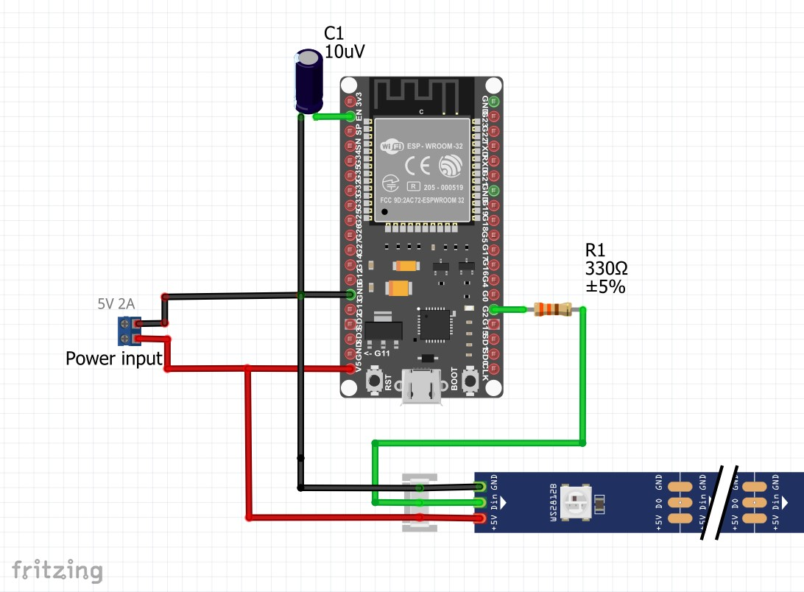

\> Work In Progress <

Still documenting the repo

# Kitboga Twitch Status

Notification sign for Kitboga status on Twitch.

### TO DO:

[ ] save `access_token` to EEPROM memory

## Description

Project uses an ESP32 to call the TwitchTV Helix API to check status of Kitboga's stream. The result is displayed on a 3D-printed sign with addressible RGBs and FastLED library.


NOTE: The STLs are a small remix of a great design by makkuro [thing:749887](https://www.thingiverse.com/thing:749887).

# Details

When my fav streamer Kitboga (https://www.twitch.tv/kitboga) comes up live I get notified with all the LEDs lighting up in the stream's colour.


When he's offline, only 1 LED over _i_ illuminates.


Also error states are displayed.

### Error Codes

-  = Power ON
-  = Unauthorized/Expired keys
-  = Auth Issue
-  = Internal Server Error
-  = WiFi Disconnected
- :cursing_face: ALL red = other unknown request failure (including response `-1`)

## Hardware BoM

- ESP32
- WS2811 addressible RGBs
- 3D-printed letters (printed separately)
- resistor, capacitor, power connector, wires

## Libriaries and other necessary resources

- access to Twich Helix API https://dev.twitch.tv/docs/api/
- HTTPClient https://www.arduino.cc/reference/en/libraries/httpclient/
- Arduino JSON https://www.arduino.cc/reference/en/libraries/arduino_json/
- FastLED https://www.arduino.cc/reference/en/libraries/fastled/

## ESP32 setup



- capacitor C1 fixes [Timed out waiting for packet header](https://randomnerdtutorials.com/solved-failed-to-connect-to-esp32-timed-out-waiting-for-packet-header/)

## API setup

1. Created a Twitch developer account to obtain access keys https://dev.twitch.tv/docs/api/
2. In Arduino IDE, filled `clientID` & `clientSecret` accordingly.

3. To obtain access token you can use Postman (see [Twich Helix API OAuth client credentials flow](https://dev.twitch.tv/docs/authentication/getting-tokens-oauth#oauth-client-credentials-flow)) or bellow step:

- Uncomment line

```
Serial.printf("Access Token: %s\n", access_token);
```

which is in function `validate()`. This prints auth token in Serial Monitor. Upload the code to the μC.

- Open serial monitor and grab the auth token. Paste it under variable `access_token` and re-upload the code.

4. The auth token lasts for around 60 days and will be renewed automatically.

Erros are shown in the Serial Monitor for debugging. Further lines from the code can be uncommented to print important variables.

## STL and printing details


- nothing special here, regular 0.2mm nozzle and low infil 15%

# Know issue

The Twich API requires HTTPS requests. However, I only managed to make this work with HTTP via HTTPClient. This, once in a while, causes the ESP32 to fail to call the API - generates http response code `-1`. A power cycle or reboot of the ESP seems to mostly fix it.. this is horrible and annoying so if you want to help and develop proper HTTPS calls (maybe with [WiFiClientSecure](https://github.com/espressif/arduino-esp32/tree/master/libraries/WiFiClientSecure) lib) then plz get involved <3

# More photos


